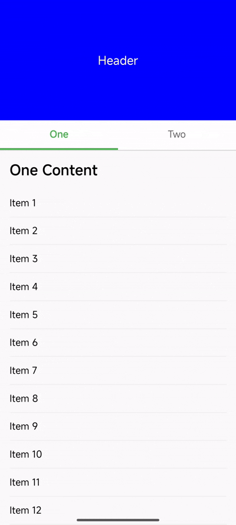

# 多 Tab 吸顶滚动同步

## 需求

1. 切换 tab one时，header 位置保持不变
2. 切换 tab one时，内容滚动位置在 item 10

## 实现方案

* 用一个独立的 `headerAnimate` 驱动 header，切换到 tab one时，内容滚动到 item 10
* 向上滚动时，header位置也向上，向下滚动时只有内容到顶部，header的位置才能向下
* react native提供的 `Animated.Value` 无法实现这种自定义的同步，使用 `addListener` 会不流畅

我知道使用 react-native-reanimated 可以实现，但他在安卓上有bug，需要开启 react native experimental release level [链接](https://docs.swmansion.com/react-native-reanimated/docs/guides/feature-flags/#disable_commit_pausing_mechanism)，这对我们来说风险太大了

求助如何实现
